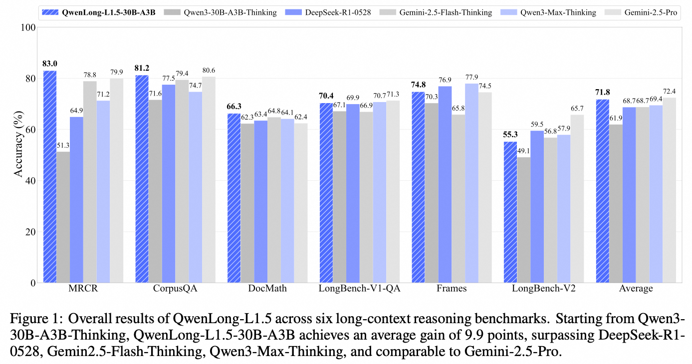
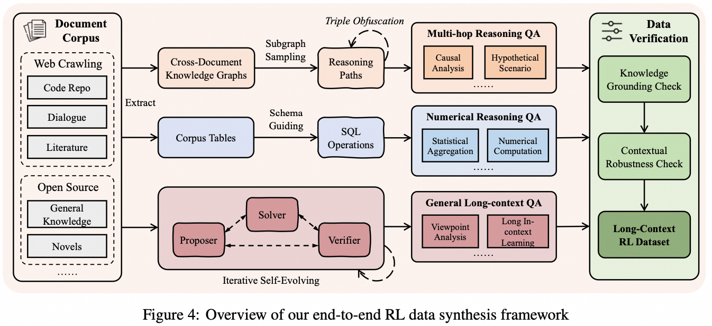
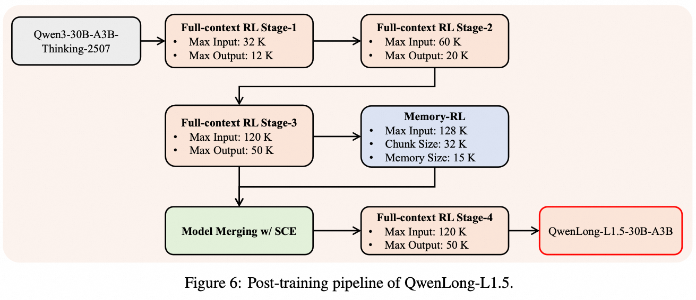

<p align="center" width="100%">
</p>

<div id="top" align="center">

QwenLong-L1.5: Post-Training Recipe for Long-Context Reasoning and Memory Management
-----------------------------
<!-- [](https://opensource.org/licenses/Apache-2.0)
[](https://arxiv.org/abs/PAPER_ID)
[](https://github.com/Tongyi-Zhiwen/QwenLong-L1.5)
[](https://modelscope.cn/models/iic/QwenLong-L1.5-30B)
[](https://huggingface.co/Tongyi-Zhiwen/QwenLong-L1.5-30B) -->

<!-- **Authors:** -->

_**Weizhou Shen, Ziyi Yang, Chenliang Li, Zhiyuan Lu, Miao Peng, Huashan Sun**_
_**Yingcheng Shi, Shengyi Liao, Shaopeng Lai, Bo Zhang**_
_**Dayiheng Liu, Fei Huang, Jingren Zhou, Ming Yan**_


<!-- **Affiliations:** -->


_Tongyi Lab, Alibaba Group_

<p align="center">
     <br>
</p>


</div>

## 🎉 News

- **Dec 15, 2025:** 🔥 We release [🤗 QwenLong-L1.5-30B-A3B](https://huggingface.co/Tongyi-Zhiwen/QwenLong-L1.5-30B-A3B), built upon Qwen3-30B-A3B-Thinking. It features a complete post-training recipe for long-context reasoning and memory management, achieving performance comparable to top-tier models like GPT-5 and Gemini-2.5-Pro.

<!-- - **[Date], 2025:** 🔥 We release [🤗 QwenLong-L1.5-30B](https://huggingface.co/Tongyi-Zhiwen/QwenLong-L1.5-30B),  -->
- **Dec 15, 2025:** 🔥 We release the [technical report](./paper/QwenLong_1_5.pdf) of QwenLong-L1.5.


## 📚 Introduction

Long-context reasoning is a critical capability for modern Large Language Models (LLMs), yet a significant gap exists in the post-training stage. The field lacks a mature, end-to-end system that provides: **(1)** a scalable pipeline for synthesizing challenging long-context reasoning data, **(2)** reinforcement learning (RL) methods tailored to the nuances of long-context reasoning, and **(3)** agent architectures designed to operate on information streams that exceed the model's context capacity.

In this work, we introduce **QwenLong-L1.5**, a long-context reasoning model built upon Qwen3-30B-A3B-Thinking, augmented with memory mechanisms to process tasks far beyond its physical context window. Our core contribution is a **full post-training recipe** that unifies data synthesis, training methodologies, and agent architectures.

<p align="center">
     <br>
</p>

First, to address the scarcity of high-quality data, we developed a novel synthesis pipeline that moves beyond simple "needle-in-a-haystack" tasks. Instead, it focuses on creating challenges that require ***multi-hop grounding and reasoning over globally distributed evidence***. This is achieved by deconstructing source documents into atomic facts and programmatically composing complex, verifiable questions from this structured information.

Second, we introduce several RL strategies to tackle the instability of long-context training. This includes **task-balanced sampling** to stabilize mini-batch distributions and our novel **Adaptive Entropy-Controlled Policy Optimization (AEPO)** algorithm, which employs an entropy-based mechanism to actively control gradients and sustain training on sequences of progressively increasing length.

Third, to handle tasks exceeding the model's physical window, we introduce a **memory management framework**. Through a multi-stage fusion RL paradigm, we synergistically combine the model's single-pass reasoning (within its 256K window) with an iterative memory updating mechanism to extend its operational range.

<p align="center">
     <br>
</p>

Our comprehensive evaluation on leading long-context benchmarks shows that **QwenLong-L1.5 surpasses its Qwen3-30B-A3B-Thinking baseline by an average of 9.9 points, achieving performance comparable to top-tier models like GPT-5 and Gemini-2.5-Pro**. Crucially, these enhancements also translate to significant gains in general domains like mathematics, tool-use, and long-dialogue scenarios, demonstrating that strong long-context ability provides a foundational boost to a model's overall reasoning capabilities.

<p align="center">
     <br>
</p>


## 🛠️ Requirements

```bash
# Create the conda environment
conda create -n qwenlongl1_5 python==3.10
conda activate qwenlongl1_5

# Install requirements
pip3 install -r requirements.txt

# Install verl, we use the 0.4 version of verl
git clone --branch v0.4 https://github.com/volcengine/verl.git
cd verl
pip3 install -e .
```


## 🚀 Quick Start

Here's how you can run the model using the 🤗 Transformers:

```python
from transformers import AutoModelForCausalLM, AutoTokenizer

model_name = "Tongyi-Zhiwen/QwenLong-L1.5-30B-A3B"

# load the tokenizer and the model
tokenizer = AutoTokenizer.from_pretrained(model_name)
model = AutoModelForCausalLM.from_pretrained(
    model_name,
    torch_dtype="auto",
    device_map="auto"
)

# prepare the model input
template = """Please read the following text and answer the question below.

<text>
$DOC$
</text>

$Q$

Format your response as follows: "Therefore, the answer is (insert answer here)"."""
context = "<YOUR_CONTEXT_HERE>" 
question = "<YOUR_QUESTION_HERE>"
prompt = template.replace('$DOC$', context.strip()).replace('$Q$', question.strip())
messages = [
    # {"role": "system", "content": "You are QwenLong-L1, created by Alibaba Tongyi Lab. You are a helpful assistant."},  # Use system prompt to define identity when needed.
    {"role": "user", "content": prompt}
]
text = tokenizer.apply_chat_template(
    messages,
    tokenize=False,
    add_generation_prompt=True
)
model_inputs = tokenizer([text], return_tensors="pt").to(model.device)

# conduct text completion
generated_ids = model.generate(
    **model_inputs,
    max_new_tokens=50000,
    temperature=0.7,
    top_p=0.95
)
output_ids = generated_ids[0][len(model_inputs.input_ids[0]):].tolist() 

# parsing thinking content
try:
    # rindex finding 151649 (</think>)
    index = len(output_ids) - output_ids[::-1].index(151668)
except ValueError:
    index = 0

thinking_content = tokenizer.decode(output_ids[:index], skip_special_tokens=True).strip("\n")
content = tokenizer.decode(output_ids[index:], skip_special_tokens=True).strip("\n")

print("thinking content:", thinking_content)
print("content:", content)
```


## 💻 Implementation of Task-balanced Sampling, Task-specific Advantage Estimation and AEPO

### Task-balanced Sampling

In the policy rollout stage, the task-balanced sampler draws an equal number of samples from each task for every training batch, ensuring a balanced task distribution within a single policy update. The implementation of the sampler is provided below (refer to [RuleReasoner](https://github.com/bigai-nlco/RuleReasoner/blob/d087e84c731a29377aa5b533b98dbaae31b11804/verl/verl/utils/dataset/rl_dataset.py#L555)):

```python
class DomainSampler:
    """A batch sampler that ensures each batch has the correct domain proportions."""

    def __init__(
        self,
        dataset: DomainWeightedRLHFDataset,
        batch_size: int,
        domain_weights: Optional[Dict[str, float]] = None,
    ):
        """
        Initialize a domain sampler.

        Args:
            dataset: The dataset to sample from
            batch_size: Size of each batch
        """
        self.dataset = dataset
        self.batch_size = batch_size
        self.domain_weights = domain_weights
        self.domains = list(domain_weights.keys())

        # Create domain indices mapping
        self.domain_indices = {domain: [] for domain in self.domains}
        for i, (domain, _) in enumerate(dataset.index_mapping):
            self.domain_indices[domain].append(i)

        # For each domain, create a shuffled list of indices
        self.domain_iterators = {domain: [] for domain in self.domains}
        for domain in self.domains:
            self._refill_domain_indices(domain)

        self.count_weight()

    def domain_weights(self) -> Dict[str, float]:
        """Return the current domain weights."""
        return self.domain_weights

    def count_weight(self):
        self.domain_counts = {}
        remaining = self.batch_size
        for domain, weight in self.domain_weights.items():
            count = int(self.batch_size * weight)
            if count > len(self.domain_indices[domain]):
                count = len(self.domain_indices[domain])
                print(f"Warning: domain {domain} doesn't have enough data points to take.")
            self.domain_counts[domain] = count
            remaining -= count
        sorted_domains = sorted(
            self.domains, key=lambda d: self.domain_weights[d], reverse=True
        )
        while remaining > 0:
            for domain in sorted_domains:
                if remaining > 0:
                    if len(self.domain_indices[domain]) > self.domain_counts[domain]:
                        self.domain_counts[domain] += 1
                        remaining -= 1
                else:
                    break

    def _refill_domain_indices(self, domain: str) -> None:
        """Refill indices for a specific domain."""
        indices = self.domain_indices[domain].copy()
        random.shuffle(indices)
        self.domain_iterators[domain] = indices

    def __len__(self):
        """Return the total number of batches."""
        return len(self.dataset) // self.batch_size

    def __iter__(self):
        """Yield batches of indices that respect domain weights."""
        while True:
            batch_indices = []

            # For each domain, select the required number of indices
            for domain, count in self.domain_counts.items():
                # Skip if the domain has no data
                if not self.domain_indices[domain]:
                    continue

                # Ensure we have enough indices
                if len(self.domain_iterators[domain]) < count:
                    self._refill_domain_indices(domain)

                # Get at most count indices (in case domain has fewer samples than needed)
                to_take = min(count, len(self.domain_iterators[domain]))
                domain_batch_indices = self.domain_iterators[domain][:to_take]
                self.domain_iterators[domain] = self.domain_iterators[domain][to_take:]
                batch_indices.extend(domain_batch_indices)

            # Shuffle the batch indices
            random.shuffle(batch_indices)
            yield batch_indices
```

and replace the data loader in your trainer with

```python
domains = dataset.domains
# default to average initialization
domain_weights = {
    domain: 1.0 / len(domains) for domain in domains
}

domain_sampler = DomainSampler(
    dataset=dataset,
    batch_size=data_config.gen_batch_size,
    domain_weights=domain_weights
)

self.train_dataloader = StatefulDataLoader(
    dataset=self.train_dataset,
    batch_sampler=domain_sampler,
    num_workers=0,
    collate_fn=collate_fn,
)
```

### Task-specific Advantage Estimation

We adopt a task-aware approach to compute the reward standard deviation when estimating advantage. Specifically, for the $i$-th response of the policy, we modify the group-level standard deviation to the standard deviation of rewards from all samples belonging to the same task within the current training batch $\mathcal{B}^{\text{task}}$:


$$A_{i}^{\text{task}} = \frac{r_{i}^{\text{task}} - \text{mean}(\{r_{k}^{\text{task}}\}_{k=1}^{G})}{\textcolor{red}{\text{std}(r^{\text{task}} | r^{\text{task}} \in \mathcal{B}^{\text{task}})}}, \quad \text{task} \in \{\text{mc, qa, niah, ...}\}$$


```python
def compute_grpo_task_norm_outcome_advantage(
    token_level_rewards: torch.Tensor,
    response_mask: torch.Tensor,
    data_source: np.ndarray,
    index: np.ndarray,
    epsilon: float = 1e-6,
    norm_adv_by_std_in_grpo: str = True
):
    scores = token_level_rewards.sum(dim=-1)

    id2score = defaultdict(list)
    task2score = defaultdict(list)
    task2std = {}
    id2mean = {}

    with torch.no_grad():
        bsz = scores.shape[0]
        for i in range(bsz):
            id2score[index[i]].append(scores[i])
            task2score[data_source[i]].append(scores[i])
        for task in task2score:
            if len(task2score[task]) == 1:
                task2std[task] = torch.tensor(0.0)
            else:
                task2std[task] = torch.std(torch.tensor([task2score[task]]))
        for idx in id2score:
            if len(id2score[idx]) == 1:
                id2mean[idx] = torch.tensor(0.0)
            elif len(id2score[idx]) > 1:
                id2mean[idx] = torch.mean(torch.tensor(id2score[idx]))
            else:
                raise ValueError(f"no score in prompt index: {idx}")
        for i in range(bsz):
            if norm_adv_by_std_in_grpo:
                scores[i] = (scores[i] - id2mean[index[i]]) / (task2std[data_source[i]] + epsilon)
            else:
                scores[i] = scores[i] - id2mean[index[i]]
        scores = scores.unsqueeze(-1) * response_mask

    return scores, scores
```

### AEPO

The Adaptive Entropy-controlled Policy Optimization (AEPO) algorithm maintains an optimal balance between exploration (increasing entropy via negative gradients) and exploitation (decreasing entropy without negative gradients). Please add the following implementation after the advantage computation step in your trainer:


```python
# Clip negative gradient when entropy > aepo_entropy_high.
if aepo_entropy_low < metrics["actor/entropy_loss"] < aepo_entropy_high:
    kept_indices = []
    initial_size = len(batch)
    advantages_per_sequence = batch.batch["advantages"][:, 0]
    advantage_mask = advantages_per_sequence > 0
    rewards = batch.batch["token_level_rewards"].sum(dim=-1)
    # ensure positive rewards
    advantage_mask = advantage_mask & (rewards > 0)
    metrics[f"train/samples_kept_after_ngc"] = advantage_mask.sum().item()
    
    kept_indices = torch.where(advantage_mask)[0].tolist()
    if len(kept_indices) % self.actor_rollout_wg.world_size != 0:
        truncated_count = (final_kept_count // self.actor_rollout_wg.world_size) * self.actor_rollout_wg.world_size
        print(f"Truncating batch from {len(kept_indices)} to {truncated_count} samples to make it divisible by world_size ({self.actor_rollout_wg.world_size})")
        kept_indices = kept_indices[:truncated_count]
        metrics["train/samples_kept_after_ngc"] = truncated_count
        print(f"After truncation: Kept {truncated_count}/{initial_size} samples.")
            
    batch = batch[kept_indices]
```


## 📊 Evaluation

*Coming soon...*

## 📝 Citation

If you find this work is relevant with your research or applications, please feel free to cite our work!
```
@article{shen2025qwenlongl15,
  title={QwenLong-L1.5: Post-Training Recipe for Long-Context Reasoning and Memory Management},
  author={Weizhou Shen, Ziyi Yang, Chenliang Li, Zhiyuan Lu, Miao Peng, Huashan Sun, Yingcheng Shi, Shengyi Liao, Shaopeng Lai, Bo Zhang, Dayiheng Liu, Fei Huang, Jingren Zhou, Ming Yan},
  year={2025}
}
```
