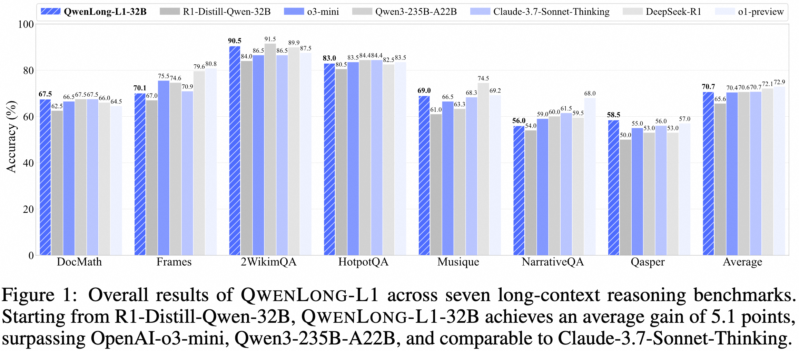
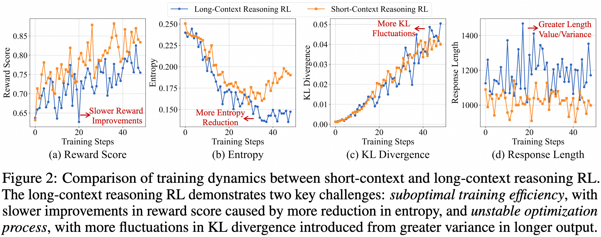
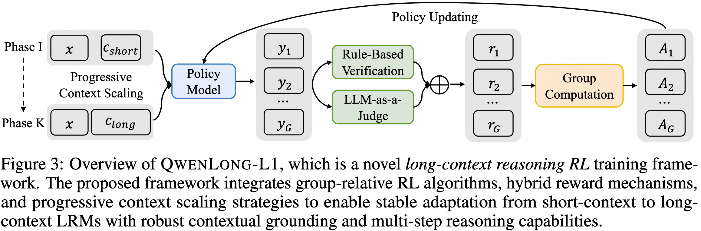
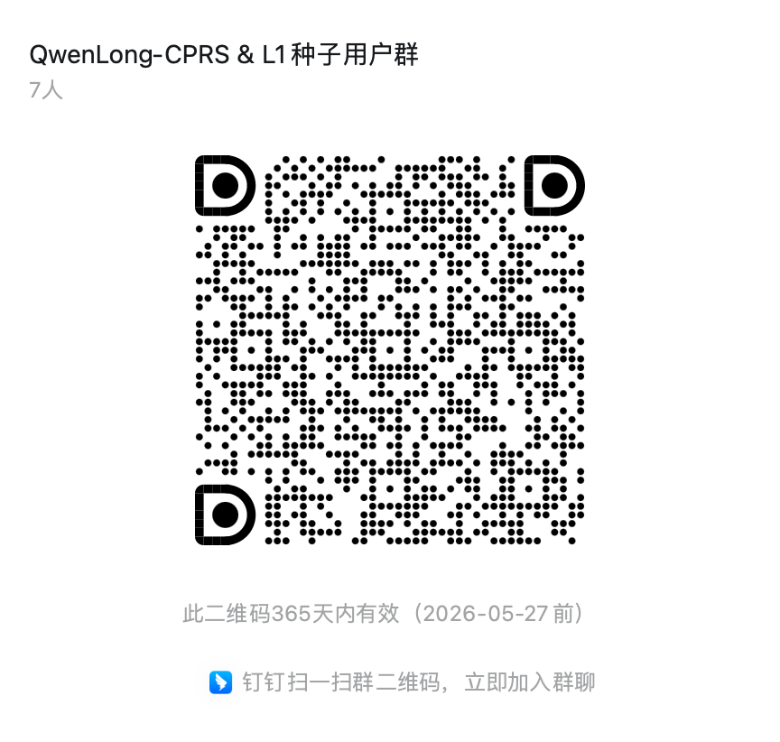

<p align="center" width="100%">
</p>

<div id="top" align="center">

QwenLong-L1: Towards Long-Context Large Reasoning Models with Reinforcement Learning
-----------------------------
[](https://opensource.org/licenses/Apache-2.0)
[](https://arxiv.org/abs/2505.17667)
[](https://github.com/Tongyi-Zhiwen/QwenLong-L1)
[](https://modelscope.cn/models/iic/QwenLong-L1-32B)
[](https://huggingface.co/Tongyi-Zhiwen/QwenLong-L1-32B)

<!-- **Authors:** -->

_**Fanqi Wan, Weizhou Shen, Shengyi Liao, Yingcheng Shi, Chenliang Li,**_

_**Ziyi Yang, Ji Zhang, Fei Huang, Jingren Zhou, Ming Yan**_


<!-- **Affiliations:** -->


_Tongyi Lab, Alibaba Group_

<p align="center">
     <br>
</p>


</div>

## 🎉 News

- **May 28, 2025:** 🔥 We release [🤗 QwenLong-L1-32B-AWQ](https://huggingface.co/Tongyi-Zhiwen/QwenLong-L1-32B-AWQ), which has undergone AWQ int4 quantization using the ms-swift framework.

- **May 26, 2025:** 🔥 We release [🤗 QwenLong-L1-32B](https://huggingface.co/Tongyi-Zhiwen/QwenLong-L1-32B), which is the first long-context LRM trained with reinforcement learning for long-context reasoning. Experiments on seven long-context DocQA benchmarks demonstrate that **QwenLong-L1-32B outperforms flagship LRMs like OpenAI-o3-mini and Qwen3-235B-A22B, achieving performance on par with Claude-3.7-Sonnet-Thinking**, demonstrating leading performance among state-of-the-art LRMs.

- **May 26, 2025:** 🔥 We release [🤗 DocQA-RL-1.6K](https://huggingface.co/datasets/Tongyi-Zhiwen/DocQA-RL-1.6K), which is a specialized RL training dataset comprising 1.6K document question answering (DocQA) problems spanning mathematical, logical, and multi-hop reasoning domains.


## 📚 Introduction

In this work, we propose QwenLong-L1, a novel reinforcement learning (RL) framework designed to facilitate the transition of LRMs from short-context proficiency to robust long-context generalization. In our preliminary experiments, we illustrate the differences between the training dynamics of short-context and long-context reasoning RL.

<p align="center">
     <br>
</p>

Our framework enhances short-context LRMs through progressive context scaling during RL training. The framework comprises three core components: a warm-up supervised fine-tuning (SFT) phase to initialize a robust policy, a curriculum-guided RL phase that facilitates stable adaptation from short to long contexts, and a difficulty-aware retrospective sampling mechanism that adjusts training complexity across stages to incentivize policy exploration. Leveraging recent RL algorithms, including GRPO and DAPO, our framework integrates hybrid reward functions combining rule-based and model-based binary outcome rewards to balance precision and recall. Through strategic utilization of group relative advantages during policy optimization, it guides LRMs to learn effective reasoning patterns essential for robust long-context grounding and superior reasoning capabilities. 

<p align="center">
     <br>
</p>


## 🎯 Model Release

We release [🤗 QwenLong-L1-32B](https://huggingface.co/Tongyi-Zhiwen/QwenLong-L1-32B), which is the first long-context LRM trained with reinforcement learniing for long-context reasoning. Experiments on seven long-context DocQA benchmarks demonstrate that **QwenLong-L1-32B outperforms flagship LRMs like OpenAI-o3-mini and Qwen3-235B-A22B, achieving performance on par with Claude-3.7-Sonnet-Thinking**, demonstrating leading performance among state-of-the-art LRMs.

Here are the evaluation results.

<p align="center">
     <br>
</p>

## 🛠️ Requirements

```bash
# Create the conda environment
conda create -n qwenlongl1 python==3.10
conda activate qwenlongl1

# Install requirements
pip3 install -r requirements.txt

# Install verl
cd verl
pip3 install -e .

# Install vLLM
pip3 install vllm==0.7.3 

# Install flash-attn
pip3 install flash-attn --no-build-isolation
```

## 🚀 Quick Start

Here's how you can run the model using the 🤗 Transformers:

```python
from transformers import AutoModelForCausalLM, AutoTokenizer

model_name = "Tongyi-Zhiwen/QwenLong-L1-32B"

# load the tokenizer and the model
tokenizer = AutoTokenizer.from_pretrained(model_name)
model = AutoModelForCausalLM.from_pretrained(
    model_name,
    torch_dtype="auto",
    device_map="auto"
)

# prepare the model input
template = """Please read the following text and answer the question below.

<text>
$DOC$
</text>

$Q$

Format your response as follows: "Therefore, the answer is (insert answer here)"."""
context = "<YOUR_CONTEXT_HERE>" 
question = "<YOUR_QUESTION_HERE>"
prompt = template.replace('$DOC$', context.strip()).replace('$Q$', question.strip())
messages = [
    # {"role": "system", "content": "You are QwenLong-L1, created by Alibaba Tongyi Lab. You are a helpful assistant."},  # Use system prompt to define identity when needed.
    {"role": "user", "content": prompt}
]
text = tokenizer.apply_chat_template(
    messages,
    tokenize=False,
    add_generation_prompt=True
)
model_inputs = tokenizer([text], return_tensors="pt").to(model.device)

# conduct text completion
generated_ids = model.generate(
    **model_inputs,
    max_new_tokens=10000,
    temperature=0.7,
    top_p=0.95
)
output_ids = generated_ids[0][len(model_inputs.input_ids[0]):].tolist() 

# parsing thinking content
try:
    # rindex finding 151649 (</think>)
    index = len(output_ids) - output_ids[::-1].index(151649)
except ValueError:
    index = 0

thinking_content = tokenizer.decode(output_ids[:index], skip_special_tokens=True).strip("\n")
content = tokenizer.decode(output_ids[index:], skip_special_tokens=True).strip("\n")

print("thinking content:", thinking_content)
print("content:", content)
```

## ♾️ Processing Long Documents

For input where the total length (including both input and output) significantly exceeds 32,768 tokens, we recommend using RoPE scaling techniques to handle long texts effectively. We have validated the model's performance on context lengths of up to 131,072 tokens using the [YaRN](https://arxiv.org/abs/2309.00071) method.

YaRN is currently supported by several inference frameworks, e.g., `transformers` and `llama.cpp` for local use, `vllm` and `sglang` for deployment. In general, there are two approaches to enabling YaRN for supported frameworks:

- Modifying the model files:
  In the `config.json` file, add the `rope_scaling` fields:
    ```json
    {
        ...,
        "rope_scaling": {
            "rope_type": "yarn",
            "factor": 4.0,
            "original_max_position_embeddings": 32768
        }
    }
    ```
  For `llama.cpp`, you need to regenerate the GGUF file after the modification.
- Passing command line arguments:

  For `vllm`, you can use
    ```shell
    vllm serve ... --rope-scaling '{"rope_type":"yarn","factor":4.0,"original_max_position_embeddings":32768}' --max-model-len 131072  
    ```
  For `sglang`, you can use
    ```shell
    python -m sglang.launch_server ... --json-model-override-args '{"rope_scaling":{"rope_type":"yarn","factor":4.0,"original_max_position_embeddings":32768}}'
    ```
  For `llama-server` from `llama.cpp`, you can use
    ```shell
    llama-server ... --rope-scaling yarn --rope-scale 4 --yarn-orig-ctx 32768
    ```
> [!IMPORTANT]
> If you encounter the following warning
> ```
> Unrecognized keys in `rope_scaling` for 'rope_type'='yarn': {'original_max_position_embeddings'}
> ```
> please upgrade `transformers>=4.51.0`.

> [!NOTE]
> All the notable open-source frameworks implement static YaRN, which means the scaling factor remains constant regardless of input length, **potentially impacting performance on shorter texts.**
> We advise adding the `rope_scaling` configuration only when processing long contexts is required. 
> It is also recommended to modify the `factor` as needed. For example, if the typical context length for your application is 65,536 tokens, it would be better to set `factor` as 2.0. 

> [!NOTE]
If the average context length does not exceed 32,768 tokens, we do not recommend enabling YaRN in this scenario, as it may potentially degrade model performance.

## 🗂️ Dataset

To construct a challenging RL dataset for verifiable long-context reasoning, we develop [🤗 DocQA-RL-1.6K](https://huggingface.co/datasets/Tongyi-Zhiwen/DocQA-RL-1.6K), which comprises 1.6K DocQA problems across three reasoning domains: 

(1) Mathematical Reasoning: We use 600 problems from the DocMath dataset, requiring numerical reasoning across long and specialized documents such as financial reports. For DocMath, we sample 75% items from each subset from its valid split for training and 25% for evaluation; 

(2) Logical Reasoning: We employ DeepSeek-R1 to synthesize 600 multi-choice questions requiring logic analysis of real-world documents spanning legal, financial, insurance, and production domains from our curated collection;

(3) Multi-Hop Reasoning: We sample 200 examples from MultiHopRAG and 200 examples from Musique, emphasizing cross-document reasoning.

Please download and put the following datasets in `./datasets/` for training and evaluation.

RL training data: [🤗 DocQA-RL-1.6K](https://huggingface.co/datasets/Tongyi-Zhiwen/DocQA-RL-1.6K).

Evaluation data: [🤗 docmath](https://huggingface.co/datasets/Tongyi-Zhiwen/docmath), [🤗 frames](https://huggingface.co/datasets/Tongyi-Zhiwen/frames), [🤗 longbench](https://huggingface.co/datasets/Tongyi-Zhiwen/longbench).

## 💻 Training

We provide the basic demo training code for single stage RL traininig with DAPO.

First, we should start a local verifier.
```bash
export CUDA_VISIBLE_DEVICES=0

vllm serve "Qwen/Qwen2.5-1.5B-Instruct" \
    --host 0.0.0.0 \
    --port 23547
```

Then, we start RL training with 4 nodes.
```bash
export PROJ_DIR="<YOUR_PROJ_DIR_HERE>"
export MASTER_IP="<YOUR_MASTER_IP_HERE>" # ray master ip
export NNODES=4 # total GPU nodes
export NODE_RANK=${RANK} # rank of current node
export PORT=6382
export WANDB_API_KEY="<YOUR_WANDB_API_KEY_HERE>"
export WANDB_PROJECT="QwenLong-L1"
export LLM_JUDGE=Y # 'Y': LLM JUDGE, 'N': RULE BASED
export VLLM_ATTENTION_BACKEND=FLASH_ATTN
# verifier
export VERIFIER_PATH="Qwen/Qwen2.5-1.5B-Instruct"
export VERIFIER_HOST="<YOUR_VERIFIER_HOST_HERE>"
export VERIFIER_PORT="23547"

ray_start_retry() {
    while true; do
        ray start --address="${MASTER_IP}:${PORT}"
        if [ $? -eq 0 ]; then
            break
        fi
        echo "Failed to connect to master, retrying in 5 seconds..."
        sleep 5
    done
}

check_ray_status() {
    until ray status >/dev/null 2>&1; do
        echo "Waiting for Ray cluster to be ready..."
        sleep 5
    done
}

if [ "$RANK" == "0" ]; then
    echo "Starting HEAD node..."
    ray start --head --port=${PORT}
    
    check_ray_status
    echo "Ray head node started successfully"

else
    echo "Starting WORKER node..."
    ray_start_retry
    
    check_ray_status
    echo "Successfully joined Ray cluster"
fi

if [ "$RANK" == "0" ]; then
    bash ${PROJ_DIR}/scripts/rl_4nodes_dapo.sh 2>&1 | tee ${PROJ_DIR}/logs/rl_log_$(date +%Y%m%d_%H%M%S).txt &
else
    sleep 30d
fi

wait
```

## 📊 Evaluation

We conduct evaluation on seven long-context DocQA benchmarks, including multi-hop reasoning benchmarks such as 2WikiMultihopQA, HotpotQA, Musique, NarrativeQA, Qasper, and Frames as well as mathematical reasoning benchmarks like DocMath. We report the maximum of exact match and LLM-judged accuracy as the final score, aligned with the reward function in our RL training process. We use DeepSeek-V3 as the judge model with a temperature of 0.0 to provide a reliable evaluation.

```bash
# Step 1. Serve the model for evaluation
export CUDA_VISIBLE_DEVICES="0,1,2,3,4,5,6,7"
MODEL_NAME="QwenLong-L1-32B"
MODEL_PATH="Tongyi-Zhiwen/QwenLong-L1-32B"

vllm serve ${MODEL_PATH} \
    --port 23547 \
    --api-key "token-abc123" \
    --tensor-parallel-size 8 \
    --gpu-memory-utilization 0.95 \
    --max_model_len 131072 \
    --trust-remote-code

# Step 2. Generate model responses for each dataset
export SERVE_HOST="<YOUR_SERVE_HOST_HERE>" # e.g., 127.0.0.1
export SERVE_PORT="23547"
PROJ_DIR="<YOUR_PROJ_DIR_HERE>"
DATA="<YOUR_DATA_HERE>" # e.g., docmath, frames, 2wikimqa, hotpotqa, musique, narrativeqa, pasper
python ${PROJ_DIR}/eval/${DATA}.py \
    --save_dir "${PROJ_DIR}/eval/results/${DATA}" \
    --save_file "${MODEL_NAME}" \
    --model "${MODEL_PATH}" \
    --tokenizer "${MODEL_PATH}" \
    --n_proc 16 \
    --api "openai"

# Step 3. Verify model responses for each dataset
export VERIFIER_API="<YOUR_API_KEY_HERE>"
export VERIFIER_URL="https://api.deepseek.com/v1"
PROJ_DIR="<YOUR_PROJ_DIR_HERE>"
DATA="<YOUR_DATA_HERE>" # e.g., docmath, frames, 2wikimqa, hotpotqa, musique, narrativeqa, pasper
python ${PROJ_DIR}/eval/${DATA}_verify.py \
    --save_dir "${PROJ_DIR}/results/${DATA}" \
    --save_file "${MODEL_NAME}" \
    --judge_model "deepseek-chat" \
    --batch_size 20
```

## 🌐 Join the Community
Chinese users can scan QR codes to join WeChat/DingTalk groups.

| WeChat | DingTalk |
|----------|---------|
|  |  |

## 📝 Citation

If you find this work is relevant with your research or applications, please feel free to cite our work!
```
@article{wan2025qwenlongl1,
  title={QwenLong-L1: : Towards Long-Context Large Reasoning Models with Reinforcement Learning},
  author={Fanqi Wan, Weizhou Shen, Shengyi Liao, Yingcheng Shi, Chenliang Li, Ziyi Yang, Ji Zhang, Fei Huang, Jingren Zhou, Ming Yan},
  journal={arXiv preprint arXiv:2505.17667},
  year={2025}
}
```


## ⭐️ Star History

[](https://star-history.com/#Tongyi-Zhiwen/QwenLong-L1&Timeline)
